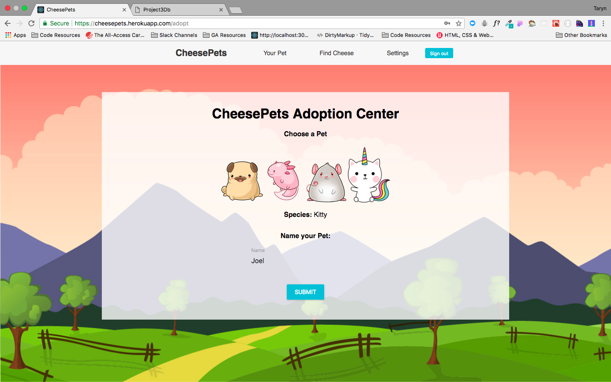

# Project 3 - CheesePets

See it in action here: https://cheesepets.herokuapp.com/

See back end code in Ruby on Rails here:
https://github.com/tarynelise/project3-db

It's an online virtual pet game. Sign up, adopt a pet, and play games to find cheese to purchase items to care for your pet!

## How to use
- Read the story on the home page then click sign up or log in to continue.
- After signing up, you'll be taken to the adoption center to choose your pet. Name your pet wisely, they cannot be renamed!

- Now when signed in, you can visit your Pets Profile page and interact with them!
- Hugging your pet or giving it nap time will increase and decrease different levels of your pets hunger, happiness, fun and energy.

- Need to feed your pet or play with it for some fun? You'll need to purchase items available at the bottom of your pet profile. Can't afford it? You'll need to find some cheese!

- Find Cheese by playing a simple Rock Paper Scissors game. If you win, you'll receive a random amount of cheese!

## Objectives
- App should have at least 3 models. Currently Users and Pets. (Items model in the future)
- Views. Use partials to DRY (Don’t Repeat Yourself) up your views.
- Handles invalid data. Forms in your application should validate data and handle incorrect inputs.
- Validate sign up information, verify valid email addresses and secure passwords.
- Use Gems Use a GEM that talks to an API to add functionality to your app. (Currently "Bcrypt" and "Knock" for user passwords and authentication)
- User Login. Make sure you have basic authentication and authorization set up (if you need it).
- Heroku. Deploy your code to Heroku.

## Built With
- HTML
- CSS (Sass)
- React.js
- Ruby on Rails
- Material UI

## Scope
CheesePets - A virtual pet game!
Features will include
- Sign up
- Sign in via email address
- Adopt a pet
- View pet profile
- Interact with pet to increase and decrease levels of happiness, hunger, fun, and energy.
- Play games to find cheese used to purchase items for pet.
- Use 'cheese' points to purchase food and toys to interact with pet.
- Have the pets image change to react to interactions.

## Approach
I first taught myself HTML when I was about 10 years old and obsessed with a virtual pet game "Dogz 3". Dogz 3 turned into Petz 5, and Petz 5 turned into Neopets, and Neopets turned into MySpace and the rest is history.

When tackling my final project, I wanted to come back full circle and create something that 10 year old Taryn would have been proud of.

I planned out my features and database first, although quickly realised I was trying to achieve far too much for a week project. I wanted to adopt a pet, interact with the pet, buy items for the pet, play multiple games to get points, and have user interactions.

After some excellent advice from GA mentors Samme and Milo, I scaled back my project and focused on the basics.

I started on my back end, and made sure the database was working correctly before I began tackling the front end. I was lucky in that I could use most of the code from my previous group project, for the user log in and sign up.

Unfortunately I found some major glitches while using this, and it took me a long time to realise that the authentication token wasn't being updated properly when I was passing the token to components via props. Once I changed the code to pull the token directly from the browsers local storage each time, I ensured that I was always using the updated token and this resolved all of the issues.

Sadly, this glitch took me a good couple of days to figure out so a lot of time was wasted on this issue.

My pet interactions were fun to build, although I quickly discovered I wasn't sure how to split the pet profile into multiple React components like I wanted, while having access to such a large number of states. I would like to do more research into state management for this situation, and perhaps something like Redux will help with this. Until then, the whole pet profile page is in one single React component which isn't ideal.

My hardest challenge was trying to put a game into React. I had already made a simple game in HTML and Javascript that I'd hoped would be easy to import, but alas was not. After spending too much time researching a solution, I decided to follow a tutorial to build a rock paper scissors game straight into React, and scrapped my other game. In my research, I did find a package that could be used to wrap phaser games so I might look into that more to implement future games.

I had a lot of fun with this project, and would like to continue working on it as a side project. I have so many more features I'd like to add, and I really want to have a whole series of games that users can play.

I also ran out of time to work on making it responsive in any way, so that's #1 on the To Do List!

## To do:
- [ ] Make responsive
- [ ] Rebuild pet profile component into smaller components. May need to use something for state management like Redux? Need to learn more about this.
- [ ] Add more games to find cheese. Perhaps built in Phaser. Need to research more about how to integrate games into a React app.
- [ ] Create a store for items and give users an inventory of purchased items.
- [ ] Allow for user interaction somehow. Follow other pets? Play with other pets?

## License
This project is licensed under the MIT license.

## Acknowledgments
As usual, thanks to Joel, John and Theo @ General Assembly for the help. Thanks to my amazing mentor Samme for being my rock.

And this article for helping me get my head around building a game in React:
https://hackernoon.com/learn-react-js-how-to-build-a-simple-rock-paper-scissors-game-b57ca663ec02

This project was undertaken as part of the General Assembly Sydney's WDI 26 course, May 2018.
